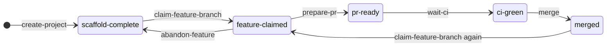
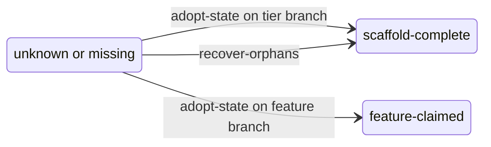

# SCM workflow state machine

The SCM portion of the kit tracks one feature's journey from a fresh scaffold to
a merged feature branch. State lives in `.lakebase/workflow-state.json` (schema:
`scripts/lakebase/scm-workflow-state.schema.json`); each `lakebase-scm-*` CLI is a
transition that asserts its from-state, does the substrate work, and records the
new state row. The forward path is exactly what the TDD driver's **promote phase**
drives after a feature is accepted.

States: `scaffold-complete -> feature-claimed -> pr-ready -> ci-green -> merged`.

## Happy path

## Recovery / bootstrap

These reconstruct state rather than advance it, for a project whose
`.lakebase/workflow-state.json` is missing or out of sync with the working tree.

`lakebase-scm-doctor [--fix]` is an advisory cross-check over the same state
(warnings plus targeted remediations); `lakebase-scm-state` reads/emits the row
(including `canonical_branch`). Neither changes the workflow state by itself.

## Transition table

| From | Action (CLI) | To | Guard / effect |
|---|---|---|---|
| (none) | `lakebase-create-project` | `scaffold-complete` | seeds the state row + tier topology |
| `scaffold-complete` or `merged` | `lakebase-scm-claim-feature-branch <id>` | `feature-claimed` | forks the paired (git + Lakebase) feature branch from the tier parent; refuses if a feature is already mid-flight |
| `feature-claimed` | `lakebase-scm-prepare-pr` | `pr-ready` | refuses a dirty CODE working tree (ignores `.tdd/` + `.lakebase/`); pushes the branch + opens the PR |
| `pr-ready` | `lakebase-scm-wait-ci` | `ci-green` | polls the PR's `pr.yml` regression gate; advances only on green (errors / stays on failure) |
| `ci-green` | `lakebase-scm-merge --wait-migrate` | `merged` | merges the PR; the parent's `merge.yml` applies migrations; stamps `merged_at` |
| `feature-claimed` | `lakebase-scm-abandon-feature` | `scaffold-complete` | only `feature-claimed` is abandonable; deletes the paired branch + resets the row |

## Tiers

The tier sets the parent each feature forks from (and the PR's merge target):

- tier 1 = prod (features fork from production)
- tier 2 = prod + staging (features fork from staging)
- tier 3 = prod + staging + dev (features fork from dev)

## Relationship to the TDD driver

The deterministic TDD driver's **promote phase** drives the forward path after a
feature is accepted: `prepare-pr -> wait-ci -> approve-promote-gate (HITL) -> merge`,
then loops back to `feature-claimed` for the next feature, so the next sprint forks
from a populated parent.
