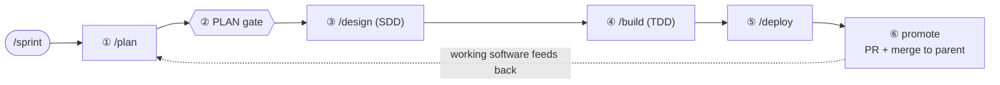
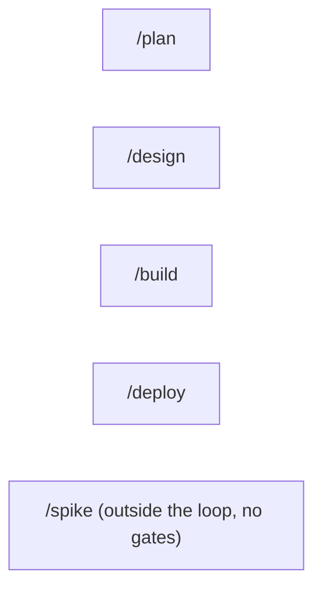
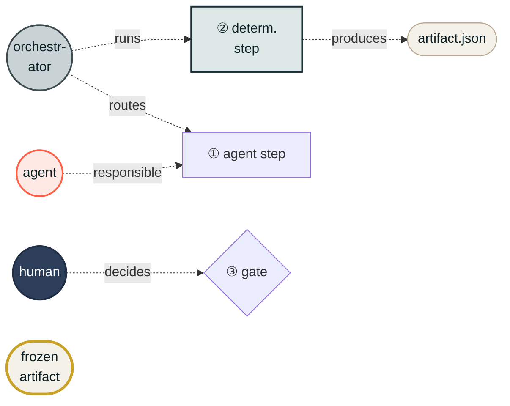
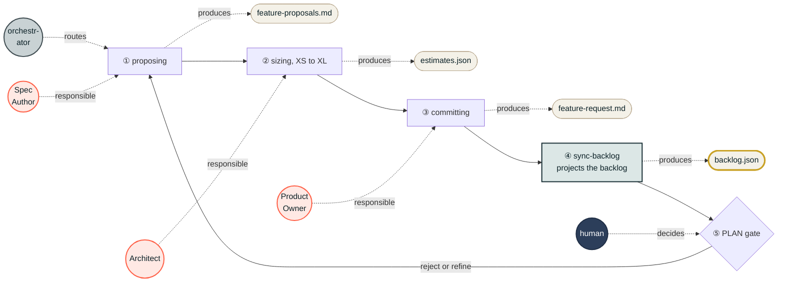
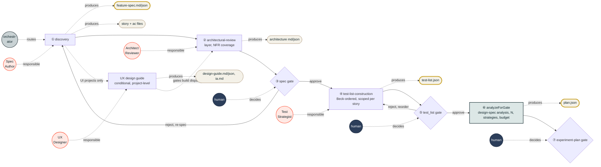
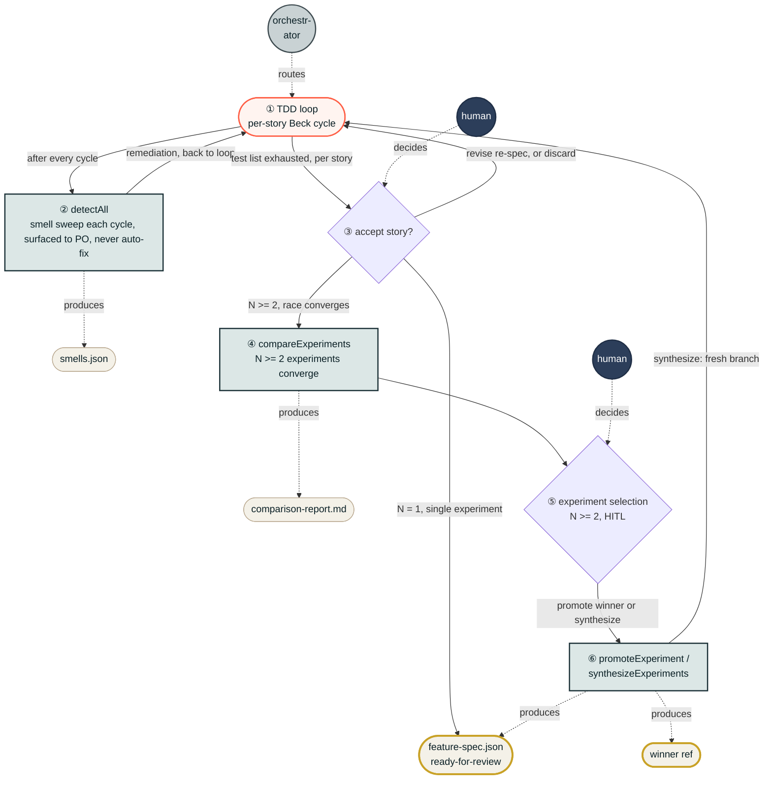
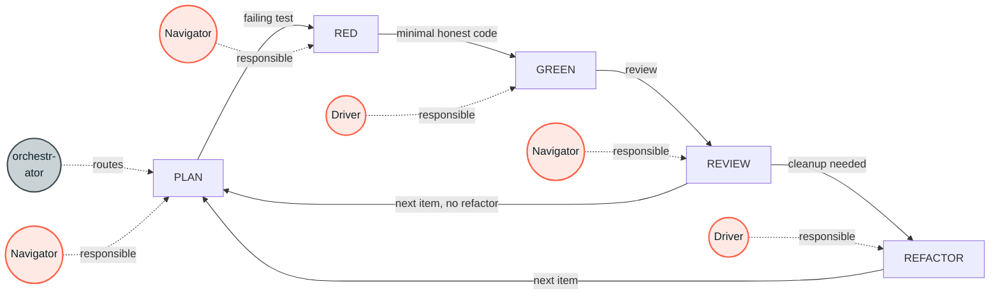
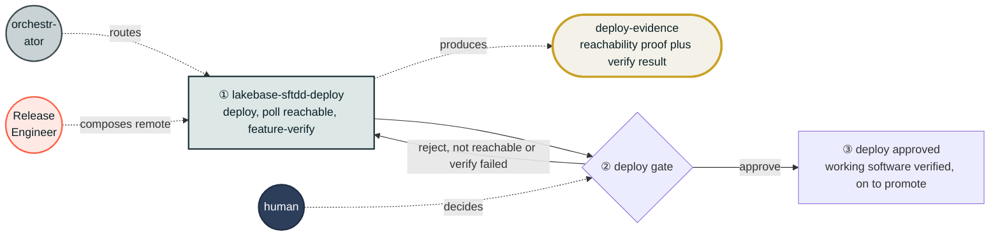
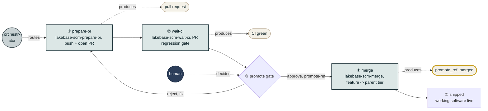
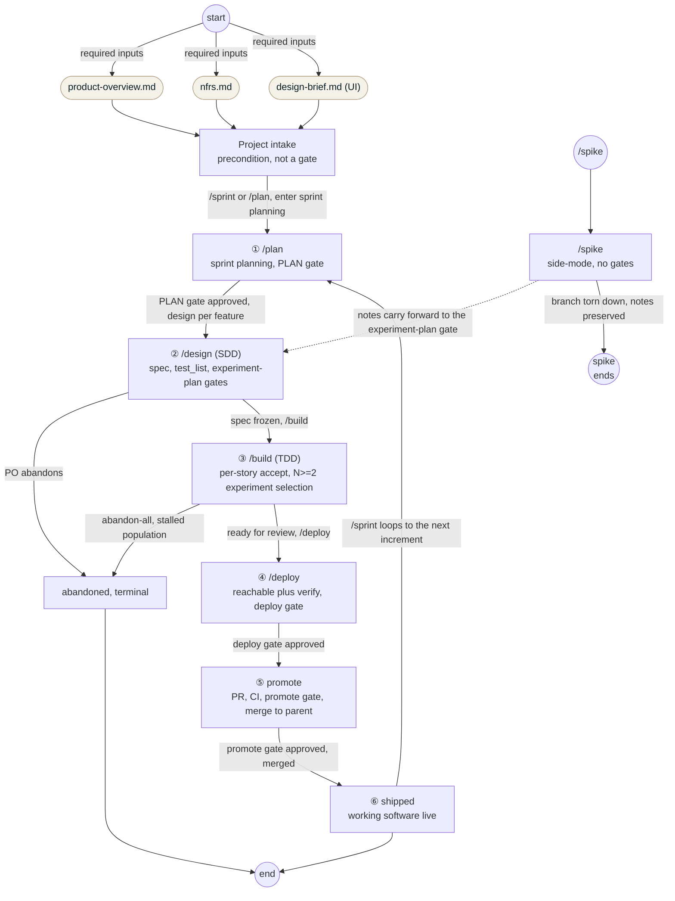

# Workflow state machine (SFTDD)

The end-to-end state machine for `lakebase-sftdd-workflows` (**Spec-First Test-Driven Development**). It composes two disciplines back to back: the **SDD** design lane (`/design`) and the **TDD** build lane (`/build`), wrapped by sprint planning (`/plan`), deploy (`/deploy`), promote (the PR + merge to the parent tier), and the top-level `/sprint` loop. The deterministic driver `lakebase-sftdd-drive` routes every transition; gates (keyed `plan` / `spec` / `test_list` / `promote` / `deploy`) are the HITL decision points.

The driver's coarse phases (`DrivePhase`) run in order: **planning -> feature (design + build) -> deploy -> promote -> done**. Deploy proves working software (local target) before promote opens the PR and merges the feature up to its parent tier; `shipped` is reached only after that merge.

Canonical phase names come from `workflow-state.json.current_workflow_phase`:
`discovery`, `architectural-review`, `test-list-construction`, `design-spec-gate`, `implementation`, `synthesis`, `review`, `promote`, `shipped`, `abandoned`.

## How a run begins

Three entry commands (all shown in the diagrams):

- **`/sprint`** (Tier 1) is the primary start: the top-level orchestrator that runs the whole loop (planning -> design -> build -> deploy -> promote) continuously and resumably, looping per increment. This is the normal way a run begins.
- **`/plan`** (Tier 2) starts the same planning phase but stops after the PLAN gate (single phase); `/design`, `/build`, `/deploy` likewise run one phase and stop.
- **`/spike`** is a side entry: throwaway exploration on its own paired branch, OUTSIDE the gated loop. Its notes carry forward into a feature's design-spec gate; its code is never promoted.

Both `/sprint` and `/plan` require project intake (`product-overview.md` + `nfrs.md`, plus `design-brief.md` for UI projects).

## Command tiers

### Tier 1: `/sprint` (one continuous, resumable loop)

The top-level orchestrator. Runs planning through promote and loops per increment.

### Tier 2: single-phase commands (run ONE phase, then stop and suggest next)

## State machine, by command

Each slash command is its own small state machine. The internal states and gate
are shown below, one command per diagram. How they connect (and everything outside
them) is in the high-level diagram that follows.

**Legend.**

Every step carries a **circled number** ①②③ giving the orchestrator's action order: ① is
the first thing the orchestrator does (route into the opening phase), and the count follows
what it does next, **including the deterministic tool runs**, which are steps in their own
right. There are two kinds of step rectangle: a **white** one is an agent-driven phase (a
**coral** agent circle is attached: Spec Author, Architect, Test Strategist, Navigator,
Driver, Release Engineer, Product Owner); a **teal** one is a deterministic step the
orchestrator runs (a tool like `sync-backlog`, `analyzeForGate`, `detectAll`,
`compareExperiments`, `promoteExperiment`, `lakebase-sftdd-deploy`), never agent-authored;
the orchestrator's running of a teal step is shown by its teal color, not a separate edge.
Diamonds are gates; **navy** circles are the human, who decides every gate, approve or
reject (the human-in-the-loop checkpoint). **Gray** circles are the deterministic
orchestrator (`lakebase-sftdd-drive`), which routes every transition, runs the deterministic
steps, and presents gates; it is drawn once, routing the opening step. **Parchment** pills
are artifacts (files written to disk), produced by the step they hang off; a pill with a
**bold gold border** is frozen by its command's gate (the exact gate-to-artifact mapping is
in the Gates table below), and a command ends at its frozen artifacts. Agents and the human
are drawn next to the step they act on.
Every gate also writes `gates.json` + `selection-log.md` (see the Gates table); those
universal records are omitted from the diagrams to reduce clutter.

### `/plan` (sprint planning, phase: planning)

### `/design` (SDD lane, Spec Driven Development)

For UI projects (a `design-brief.md` exists at intake) a conditional **UX Designer** step
runs after discovery: it writes the project-level design guide + information architecture
that downstream UI must adhere to. The guide must exist before the build lane can dispatch
any story (a readiness check, shown dashed). Pure API / CLI / Infra features skip it.

### `/build` (TDD lane, Test Driven Development)

Read the circled step numbers ① to ⑥ for the orchestrator's order, starting at the TDD
oval. The deterministic steps are the teal ones: `detectAll` (②) runs each cycle, then on
loop end `compareExperiments` (④, N>=2), then once the PO picks `promoteExperiment` or
`synthesizeExperiments` (⑥). The TDD loop itself (the oval) is expanded in the next diagram.
Note: this N>=2 **experiment-selection** decision (which experiment becomes the feature's
code) is distinct from the `promote` **gate**, which lives in the later promote phase (the
PR + merge of the whole feature to its parent tier).

#### The TDD loop (Beck cycle)

The Beck cycle is the inner row, PLAN to REFACTOR. The orchestrator routes into PLAN to
start each cycle; the Navigator and Driver do the work; the agents never write the cycle
artifacts.

### `/deploy`

### promote (PR + merge to parent tier)

After the deploy gate, the orchestrator runs the promote phase: it opens the PR, waits for
CI, surfaces the `promote` gate to the human, then merges the feature up to its parent tier.
The deterministic steps compose `lakebase-scm-*`; the `promote` gate is the only HITL step.
`shipped` (working software live, merged) is reached only here.

## High-level state machine

Each command is an orchestrator-driven sub-machine (detailed in the diagrams above); here
they are black boxes wired together. The deterministic orchestrator (`lakebase-sftdd-drive`)
drives every transition; the circled numbers ① to ⑥ give its order through the phases, and
each solid forward arrow leaving a phase is that phase's gate, approved by the human. Living
outside the per-phase machines are the `intake` precondition (its three required inputs),
the `/sprint` loop back from shipped, the `/spike` side-entry, and the `abandoned` terminal.

## States

| State (phase) | Lane | Command | What happens | Exit gate |
|---|---|---|---|---|
| Project intake | precondition | (none) | `product-overview.md` + `nfrs.md` (+ `design-brief.md` for UI) exist | none (precondition) |
| `planning` (proposing / sizing / committing) | sprint | `/plan`, `/sprint` | Spec Author proposes breakdown; Architect sizes; PO commits `feature-request.md`; `sync-backlog` builds `backlog.json` | **`plan` gate** |
| `discovery` | SDD | `/design` | Spec Author drafts `feature-spec` + stories + ACs | feeds `spec` gate |
| UX design (conditional, UI only) | SDD | `/design` | UX Designer writes the project-level `design-guide.{md,json}` + `ia.md`; readiness gates build dispatch | none (readiness check) |
| `architectural-review` | SDD | `/design` | Architect Reviewer assigns `layer` + `architectural_notes`, writes `architecture` md/json, covers NFRs | **`spec` gate** (arch folds in) |
| `test-list-construction` | SDD | `/design` | Test Strategist builds the Beck-ordered test list, scoped per story | **`test_list` gate** |
| `design-spec-gate` | SDD | `/design` | Analyzer proposes the experiment plan (N, strategies, budget) to `plan.json`; PO signs off | experiment-plan approval |
| `implementation` | TDD | `/build` | Per-story experiment; Navigator runs PLAN/RED/REVIEW, Driver runs GREEN/REFACTOR; smells after each cycle | per story: **accept / discard / revise** |
| `synthesis` | TDD | `/build` | N>=2 only: `compareExperiments` report; PO selects the winner or synthesizes (`promoteExperiment` / `synthesizeExperiments`) | experiment selection (HITL, not the `promote` gate) |
| `review` | TDD | `/build` | Ready-for-review: accepted experiment merged into the feature branch | (feature-complete, to deploy) |
| `deploy` | deploy | `/deploy` | Deploy merged feature/story; poll reachable; run feature-verify | **`deploy` gate** |
| `promote` | promote | (sprint) | `prepare-pr` (open PR) -> `wait-ci` (regression gate) -> **`promote` gate** -> `merge` to parent tier | **`promote` gate** |
| `shipped` | terminal | (loop) | Working software live, merged to parent; feeds the next `/plan` | loops to planning |
| `abandoned` | terminal | (any) | PO abandons, or stalled experiment population (`abandon-all`) | none |
| `spike` | side-mode | `/spike` | Throwaway branch, no gates; notes carry forward to a feature's experiment-plan gate | none |

## Gates (HITL decision points)

Gate statuses: `open` / `approved` / `superseded` / `withdrawn` (`gates.json`, ADR-0004).

**Produced after every gate, regardless of which one.** On approval the substrate writes
the same three records every time:

1. **`gates.json` entry** (the authoritative machine state): `status: approved`, decider,
   timestamp, and a content hash of each certified artifact, so `verifyGateIntegrity`
   can later flag drift if a frozen file changes. Agents read this.
2. **`selection-log.md` append** (the human-readable narrative-of-record): one
   append-only decision line. Humans read this; the substrate dual-writes it at every
   state change.
3. **`gate.approved` event** in `.tdd/agent-log.jsonl`.

**The specific artifact each gate certifies (freezes):**

| Gate | `gates.json` key | Decided after | Certifies (frozen artifact) | Reject path |
|---|---|---|---|---|
| sprint PLAN gate | sprint-level (not a per-feature key) | sprint planning | `backlog.json` (committed feature ids + sizes) | refine planning |
| spec gate | `spec` | discovery + architectural-review | `feature-spec.{md,json}` + per-story `story.{md,json}` + `acs/<AC>.{md,json}` (architecture folds in) | back to discovery (re-spec) |
| test_list gate | `test_list` | test-list-construction | `test-list.json` (Beck-ordered, scoped per story) | back to test-list (reorder) |
| experiment-plan gate (design-spec-gate) | `plan` | `analyzeForGate` proposal | `plan.json` (`{ feature_id, N, mode, strategies[], budget, rationale }`, plus attached `spike_inputs[]`) | renegotiate the plan |
| deploy gate | deploy-evidence (not a per-feature key) | deploy | deploy-evidence: reachability proof + `feature-verify` result against the running app | back to deploy (fix) |
| promote gate | `promote` | the promote phase, after `prepare-pr` + `wait-ci` (CI green) | the PR / merge of the feature to its parent tier (`--promote-ref`) | back to prepare-pr (fix) |

The deploy gate is decided before the promote gate (phase order: deploy -> promote). The
N>=2 **experiment selection** in `/build` (PO picks the winning experiment via
`promoteExperiment`, or `synthesizeExperiments`) is also a HITL decision but is **not** one
of the five `gates.json` keys; it selects which experiment becomes the feature's code, which
the `promote` gate then merges upstream.

## Invariants

- **Spec-first within an increment.** The `spec` and `test_list` gates freeze the spec before any product code; the TDD lane refuses to start until they are approved.
- **Evolutionary across increments.** The freeze is per increment, not forever: each `/plan` re-plans from the last working software; architecture evolves under fitness functions; the database evolves by migration on the paired branch, diffed against its parent.
- **The orchestrator never writes spec/code/tests.** `lakebase-sftdd-drive` is deterministic routing; the eight role agents (Product Owner, Spec Author, UX Designer (UI only), Architect Reviewer, Test Strategist, Navigator, Driver, Release Engineer) do the work, communicating only through on-disk artifacts.
- **Every gate is HITL.** Live, the human answers; headless, the Human Proxy answers only on present + format-conformant artifacts.
- **Escalation pre-empts every transition.** While an unresolved escalation exists (a failed honest-GREEN, a blocking smell, a deploy verify-fail), the driver routes to a single raise-to-hil halt before any forward step. It is a routing rule, not a side effect, so it is not drawn as an edge on each diagram but applies to all of them.
- **The design lane streams per story.** Stories flow through `/design` one at a time onto a ready queue; story N can be building while story N+1 is still being designed. The per-command diagrams show one story's path for clarity.
